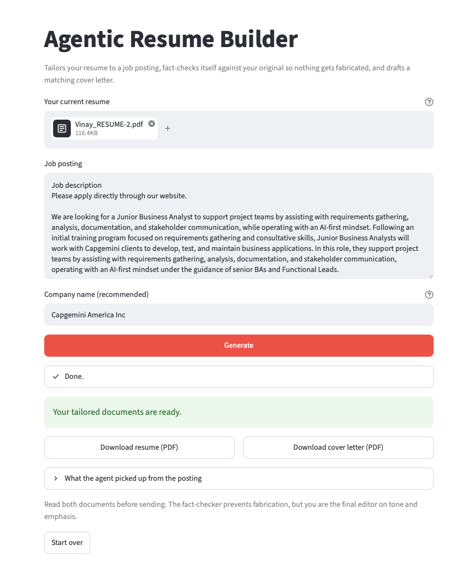

# Agentic Resume Builder



An agent that tailors your resume to a specific job posting. Every time you
find a new posting, feed it in and get back a tailored, one-page PDF resume
in about 30-60 seconds.

## How it works (the "agentic" part)

Instead of one prompt -> one output, the script runs a 4-step pipeline where
each step's output decides what happens next:

1. **Extract** - reads the job posting and pulls out required skills, ATS
   keywords, and the real focus of the role.
2. **Tailor** - rewrites your summary, reorders your skills, and rewords your
   bullet points to speak to those requirements — using ONLY facts already
   in your original resume.
3. **Verify** - a separate pass fact-checks the tailored draft against your
   original resume and flags anything that looks made up.
4. **Revise (loop)** - if issues are found, it automatically regenerates the
   draft with those issues called out, up to 2 times.
5. **Render** - writes the final, verified content into a clean PDF.

This means it will never invent a skill, tool, or accomplishment you don't
actually have — it repositions what's true, it doesn't fabricate.

## Setup

```bash
pip install -r requirements.txt
export ANTHROPIC_API_KEY="your-key-here"   # from console.anthropic.com
```

Then create your own resume source file by copying the example:

```bash
cp resume_source.example.txt resume_source.txt
```

Edit `resume_source.txt` with your real details. This file is git-ignored,
so your personal information stays local and never gets committed.

**Bring your own API key.** This tool calls the Anthropic API, and charges
land on whichever key makes the request — so running it uses your own
Anthropic account, not anyone else's. Each run costs a few cents.
Never commit your key; the included `.gitignore` helps.

## Two ways to use it

### Web interface (easiest)

```bash
streamlit run app.py
```

Opens in your browser. Upload your resume, paste the job posting, enter the
company name, click Generate, and download both PDFs. The agent's progress
is shown live as it works through each step.

The app reads your `ANTHROPIC_API_KEY` from the environment if it is set;
otherwise it asks for one in a masked field. Either way the key is used in
memory for that request only — it is never written to disk or logged.

### Command line

```bash
python agentic_resume_builder.py \
    --resume resume_source.txt \
    --job job_posting.txt \
    --company "HackerEarth" \
    --output Vinay_Resume_HackerEarth.pdf
```

This produces TWO files:
- `Vinay_Resume_HackerEarth.pdf` (the tailored resume)
- `Vinay_Resume_HackerEarth_cover_letter.pdf` (a matching cover letter)

Add `--no-cover-letter` if you only want the resume.
Use `--job-text "pasted posting text"` instead of `--job` to paste inline.
Your resume file can be `.txt`, `.pdf`, or `.docx`.

### Naming the employer (important)

Many job-board postings never state the actual company in the description
text — or they mention tools/platforms the company uses, which the agent
can mistake for the employer. To avoid a cover letter addressed to the
wrong company, pass the employer name explicitly:

```bash
python agentic_resume_builder.py \
    --resume resume_source.txt \
    --job job_posting.txt \
    --company "HackerEarth" \
    --output Vinay_Resume_HackerEarth.pdf
```

If you leave `--company` off, the agent will try to identify the employer
from the posting and will fall back to a neutral "Hiring Team" (no company
name) rather than guessing when it isn't clearly stated.

## Files in this folder

- `agentic_resume_builder.py` - the agent
- `resume_source.txt` - your resume in plain text, ready to reuse for future postings
- `Vinay_Siddi_Resume_Zerve_DataAnalyst.pdf` - a sample tailored resume already generated for the Zerve Data Analyst posting, so you can see the output quality before running it yourself

## Notes / things worth knowing

- Each run costs a small amount on your Anthropic API usage (a few cents per resume) since it makes several model calls.
- The verify/revise loop is there specifically to prevent resume fabrication — worth keeping even if it adds a call or two.
- If you want to tweak the visual layout (fonts, spacing, section order), edit the `render_pdf()` function — it's plain reportlab, no magic.
- Want it to also draft a matching cover letter? That's a natural next step to bolt onto this same pipeline (extract -> tailor resume -> tailor cover letter -> render both) if you want it added.
